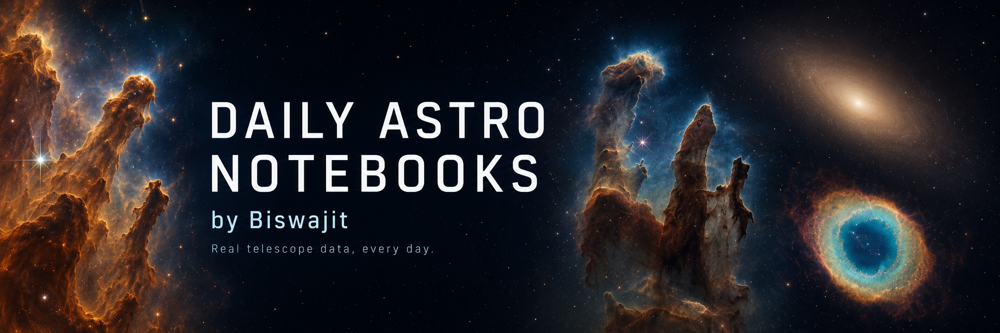

<p align="center">
  
</p>
<p align="center"><em>Carina Nebula, Eagle Nebula, and the Ring Nebula. Every plot, spectrum, light curve, and image inside <code>sdss/</code>, <code>mast/</code>, <code>gaia/</code>, and <code>exoplanet-archive/</code> is real archive data, pulled and processed by the notebooks themselves — see the real JWST/HST captures directly in <a href="mast/"><code>mast/</code></a>.</em></p>

# Daily Astro Notebooks

**by Biswajit**

<p>
  <a href="https://biswajit1999.github.io/daily-astro-notebooks/"><strong>Explore the notebook dashboard →</strong></a>
</p>

A running, dated log of real-data astronomy analysis. Every day I add new
notebooks under one of the four archive folders below, using actual public
data — real spectra, real telescope images, real light curves, real catalog
queries. No toy or simulated data, ever, unless a notebook says so explicitly
(and even then it's clearly labeled).

Each notebook is written to run in Google Colab: open it straight from GitHub
using the "Open in Colab" badge at the top of the notebook — no download,
no setup, just run it.

## Why this exists

I wanted a public, dated paper trail of hands-on data analysis across the
big public astronomy archives — not tutorials I've only read, but notebooks
I've actually run against real data, with real output baked in. It's part
practice, part portfolio, part just wanting to look at real telescope data
every day instead of talking about it.

## Folders

| Folder | Archive | What's in it |
|---|---|---|
| [`sdss/`](sdss/) | Sloan Digital Sky Survey | Stellar and quasar spectra, redshifts, metallicities, spectral classification — via `astropy` + `astroquery.sdss` / direct FITS reads |
| [`mast/`](mast/) | MAST (Hubble, JWST, Kepler, TESS) | Real telescope images of nebulae and galaxies, exoplanet-host light curves, transit periodograms — via `astroquery.mast` + `lightkurve` |
| [`gaia/`](gaia/) | ESA Gaia | HR diagrams, cluster membership by proper motion, parallax-based distances, wide binaries — via `astroquery.gaia` (TAP) |
| [`exoplanet-archive/`](exoplanet-archive/) | NASA Exoplanet Archive | Transit depth vs. radius, habitable-zone checks, radial-velocity curves, mass–period trends — via TAP queries |

Each dated subfolder contains:

- `notebook.ipynb` — the analysis, run end-to-end with real output baked in
  (printed values, real plots — not just code)
- `README.md` — a short, plain-language writeup: what I looked at, what I
  found, what surprised me
- any small plot/image files the notebook produced

## What's here so far

**50 notebooks, 4 archives, 2 observing-log dates — 29 now meet the deeper analysis standard, including five scientifically audited early notebooks.**

The [dashboard](https://biswajit1999.github.io/daily-astro-notebooks/) is built from the repository itself. A new notebook appears there automatically after it is merged into `master` and the Pages workflow completes.

### Latest results

| Question | Data | Main result |
|---|---|---|
| Where is the small-planet radius valley? | NASA Exoplanet Archive, 2,070 planets | Minimum at **1.83 Earth radii**; 68% bootstrap range **1.80–1.86** |
| Are close-in giant planets more circular? | NASA Exoplanet Archive, 944 giants | Median eccentricity **0.000** below 5 days and **0.120** at 10–100 days |
| How far away is the Pleiades? | Gaia, 609 candidate members | Weighted parallax **7.374 mas**, giving **135.6 pc** |
| Which lines are present in an HST stellar spectrum? | HST/STIS spectrum of HD 93521 | All five tested H/He features recovered; H-alpha equivalent width **1.48 Å** |
| What powers the emission in nearby galaxies? | SDSS, 12,000 spectra | **73.1%** star-forming, **17.3%** composite, **9.6%** active-galaxy branch in the selected sample |

### 50-notebook expansion

The newest 15 analyses deliberately include positive, negative, and method-limited results. Highlights include a hot-Jupiter radius–temperature rank correlation (**ρ = 0.558**), no detected Pleiades mass-segregation signal in the chosen angular sample (**permutation p = 0.619**), a Pleiades line-of-sight depth proxy of **2.16 pc**, an SDSS Balmer-decrement estimate of **E(B−V) = 0.327 mag**, and a demonstration that the H-alpha equivalent width changes by more than 100% across plausible continuum and integration choices in this low-resolution spectrum.

Four earlier notebooks were also repaired rather than merely given decorative images. TRAPPIST-1 and Kepler-442 b now have calculated orbital-zone figures. The Sirius and Vega notebooks now audit source identity against the Hipparcos catalogue; this corrects the earlier Vega cone-search mismatch that returned a background source while the prose described Vega's well-known nearby distance.

### Scientific Audit Batch 1

Five early MAST notebooks now expose multiple evidence figures, exact product
provenance, reusable tables, uncertainty or parameter stress tests, literature
context, and an explicit claim boundary. Kepler-10 b is recovered as a positive
remeasurement. TOI-700 d remains an exploratory null result when the simple
bootstrap interval includes zero. The selected Ring Nebula preview is also
labelled as a field mismatch rather than being used for a misleading shape
measurement. Negative results are preserved because they show exactly what the
current product or method cannot support.

<details>
<summary><b>sdss/</b> — 13 notebooks</summary>

- [`star-spectrum-classification`](sdss/2026-07-30-star-spectrum-classification/) — classifying a star from its raw spectrum
- [`qso-redshift-check`](sdss/2026-07-30-qso-redshift-check/) — measuring a quasar's redshift from its emission lines
- [`emission-line-measurement`](sdss/2026-07-30-emission-line-measurement/) — measuring an H-alpha emission line
- [`metallicity-vs-position`](sdss/2026-07-30-metallicity-vs-position/) — stellar metallicity vs. position in the galaxy
- [`spectral-type-distribution`](sdss/2026-07-30-spectral-type-distribution/) — how spectral types are distributed across a sample
- [`white-dwarf-spectrum`](sdss/2026-07-30-white-dwarf-spectrum/) — looking at a white dwarf's spectrum
- [`galaxy-redshift-slice`](sdss/2026-07-30-galaxy-redshift-slice/) — a redshift "cone diagram" slice of galaxies
- [`qso-vs-galaxy-colors`](sdss/2026-07-30-qso-vs-galaxy-colors/) — telling quasars and galaxies apart by color
- [`sdss-bpt-galaxy-classification`](sdss/2026-07-31-sdss-bpt-galaxy-classification/) — separating star-forming, composite, and active galaxies with four emission lines
- [`balmer-decrement-dust`](sdss/2026-07-31-balmer-decrement-dust/) — estimating a nebular dust indicator from H-alpha and H-beta
- [`n2-metallicity-proxy`](sdss/2026-07-31-n2-metallicity-proxy/) — measuring an approximate oxygen-abundance distribution on the star-forming branch
- [`excitation-redshift-selection`](sdss/2026-07-31-excitation-redshift-selection/) — testing how the observed [O III]/H-beta ratio changes with redshift and selection
- [`bpt-snr-sensitivity`](sdss/2026-07-31-bpt-snr-sensitivity/) — quantifying how line-quality cuts move BPT class fractions

</details>

<details>
<summary><b>mast/</b> — 12 notebooks</summary>

- [`jwst-image-carina-nebula`](mast/2026-07-30-jwst-image-carina-nebula/) — real JWST NIRCam image of the Carina Nebula
- [`hst-image-eagle-nebula`](mast/2026-07-30-hst-image-eagle-nebula/) — Hubble image of the Eagle Nebula (Pillars of Creation)
- [`jwst-image-ring-nebula`](mast/2026-07-30-jwst-image-ring-nebula/) — real JWST image of the Ring Nebula
- [`hst-cutout-m87`](mast/2026-07-30-hst-cutout-m87/) — Hubble cutout of the M87 galaxy
- [`kepler-lightcurve-kepler10b`](mast/2026-07-30-kepler-lightcurve-kepler10b/) — Kepler-10b transit light curve
- [`kepler-lightcurve-kepler186f`](mast/2026-07-30-kepler-lightcurve-kepler186f/) — Kepler-186f transit light curve
- [`tess-lightcurve-toi700`](mast/2026-07-30-tess-lightcurve-toi700/) — TESS light curve for TOI-700 d
- [`periodogram-hat-p-7b`](mast/2026-07-30-periodogram-hat-p-7b/) — box-least-squares transit search for HAT-P-7b
- [`hst-stis-hd93521-line-inventory`](mast/2026-07-31-hst-stis-hd93521-line-inventory/) — fitting hydrogen and helium features in a calibrated Hubble spectrum
- [`hst-stis-continuum-slope`](mast/2026-07-31-hst-stis-continuum-slope/) — fitting an empirical power law to the line-masked optical continuum
- [`hst-halpha-equivalent-width-systematics`](mast/2026-07-31-hst-halpha-equivalent-width-systematics/) — measuring how continuum and integration choices change H-alpha equivalent width
- [`hst-m87-image-morphology`](mast/2026-07-31-hst-m87-image-morphology/) — measuring display-image centroid, axis ratio, and half-light-radius proxies without claiming calibrated photometry

</details>

<details>
<summary><b>gaia/</b> — 12 notebooks</summary>

- [`hr-diagram-pleiades`](gaia/2026-07-30-hr-diagram-pleiades/) — HR diagram of the Pleiades
- [`hr-diagram-hyades`](gaia/2026-07-30-hr-diagram-hyades/) — HR diagram of the Hyades
- [`hr-diagram-ngc188`](gaia/2026-07-30-hr-diagram-ngc188/) — HR diagram of open cluster NGC 188
- [`proper-motion-membership-m67`](gaia/2026-07-30-proper-motion-membership-m67/) — finding true M67 members by proper motion
- [`parallax-distance-vega`](gaia/2026-07-30-parallax-distance-vega/) — distance to Vega from its parallax
- [`parallax-distance-sirius`](gaia/2026-07-30-parallax-distance-sirius/) — distance to Sirius from its parallax
- [`wide-binary-search-alpha-cen`](gaia/2026-07-30-wide-binary-search-alpha-cen/) — looking for wide binary companions near Alpha Centauri
- [`gaia-pleiades-membership-distance`](gaia/2026-07-31-gaia-pleiades-membership-distance/) — selecting Pleiades members and measuring a bootstrap-tested cluster distance
- [`pleiades-cmd-ruwe-binaries`](gaia/2026-07-31-pleiades-cmd-ruwe-binaries/) — testing whether over-luminous sequence outliers also have poorer astrometric fits
- [`pleiades-mass-segregation-proxy`](gaia/2026-07-31-pleiades-mass-segregation-proxy/) — checking whether brighter members are more centrally concentrated
- [`pleiades-proper-motion-dispersion`](gaia/2026-07-31-pleiades-proper-motion-dispersion/) — subtracting reported measurement errors from the cluster motion width
- [`pleiades-line-of-sight-depth`](gaia/2026-07-31-pleiades-line-of-sight-depth/) — testing whether the parallax width exceeds formal errors

</details>

<details>
<summary><b>exoplanet-archive/</b> — 13 notebooks</summary>

- [`transit-depth-vs-radius`](exoplanet-archive/2026-07-30-transit-depth-vs-radius/) — transit depth vs. planet radius across confirmed planets
- [`habitable-zone-trappist1`](exoplanet-archive/2026-07-30-habitable-zone-trappist1/) — checking which TRAPPIST-1 planets fall in the habitable zone
- [`habitable-zone-kepler442`](exoplanet-archive/2026-07-30-habitable-zone-kepler442/) — habitable-zone check for Kepler-442
- [`rv-curve-51-pegasi-b`](exoplanet-archive/2026-07-30-rv-curve-51-pegasi-b/) — radial-velocity curve for 51 Pegasi b, the first exoplanet found around a Sun-like star
- [`rv-curve-hd189733b`](exoplanet-archive/2026-07-30-rv-curve-hd189733b/) — radial-velocity curve for HD 189733 b
- [`mass-period-trend`](exoplanet-archive/2026-07-30-mass-period-trend/) — how planet mass trends with orbital period
- [`eccentricity-distribution`](exoplanet-archive/2026-07-30-eccentricity-distribution/) — how eccentric confirmed planet orbits actually are
- [`exoplanet-radius-valley`](exoplanet-archive/2026-07-31-exoplanet-radius-valley/) — locating the scarcity of planets between super-Earths and sub-Neptunes
- [`hot-jupiter-tidal-circularisation`](exoplanet-archive/2026-07-31-hot-jupiter-tidal-circularisation/) — testing how giant-planet eccentricity changes with orbital period
- [`exoplanet-discovery-method-timeline`](exoplanet-archive/2026-07-31-exoplanet-discovery-method-timeline/) — tracing how the archive's discovery-method mixture changed over time
- [`hot-jupiter-radius-inflation`](exoplanet-archive/2026-07-31-hot-jupiter-radius-inflation/) — testing the giant-planet radius relation with host temperature
- [`eccentricity-discovery-bias`](exoplanet-archive/2026-07-31-eccentricity-discovery-bias/) — comparing recorded eccentricities across discovery channels
- [`single-vs-multiplanet-systems`](exoplanet-archive/2026-07-31-single-vs-multiplanet-systems/) — comparing radii around single- and multi-transiting hosts

</details>

## How I work

1. Pick a real, specific target or question — not "explore Gaia data," but
   "how far away is Vega, using its actual parallax."
2. Query the real archive (`astroquery`, `sdss_access`, or a direct TAP/HTTP
   call) — no cached fake data, no placeholder plots.
3. Run the notebook top to bottom so the checked-in `.ipynb` already has the
   real output in it — anyone opening it in Colab sees exactly what I saw.
4. Write the README in plain language, like I'm explaining it to a friend
   who isn't an astronomer — technical terms get defined the first time
   they show up, not assumed.

The deeper notebooks also state a testable question, record the exact sample cuts, attach uncertainty to the main number, check at least one possible bias, and compare the result with published work. See the full [notebook analysis standard](NOTEBOOK_STANDARD.md).

## Reproduce the work

```bash
python -m pip install -r requirements.txt
python tools/run_notebooks.py --date 2026-07-31
python tools/validate_repository.py
```

To rebuild the dashboard catalogue and site locally:

```bash
python tools/build_catalog.py
cd dashboard
npm install
npm run dev
```

Contribution guidance is in [CONTRIBUTING.md](CONTRIBUTING.md).

## Tools used

`astropy` · `astroquery` (`.mast`, `.gaia`, `.sdss`) · `lightkurve` · `pyvo`
· `numpy` / `matplotlib` · `sdss_access`

## Citing the data

Every notebook closes with a citation for the archive it pulled from. As a
general rule:

- SDSS — [sdss.org/collaboration/citing-sdss](https://www.sdss.org/collaboration/citing-sdss/)
- MAST — [archive.stsci.edu/publishing](https://archive.stsci.edu/publishing/)
- Gaia — [cosmos.esa.int/web/gaia-users/credits](https://www.cosmos.esa.int/web/gaia-users/credits)
- NASA Exoplanet Archive — [exoplanetarchive.ipac.caltech.edu/docs/counts_detail.html](https://exoplanetarchive.ipac.caltech.edu/docs/counts_detail.html)

---

Maintained by **Biswajit** ([@Biswajit1999](https://github.com/Biswajit1999)).
New real-data notebooks added daily.
