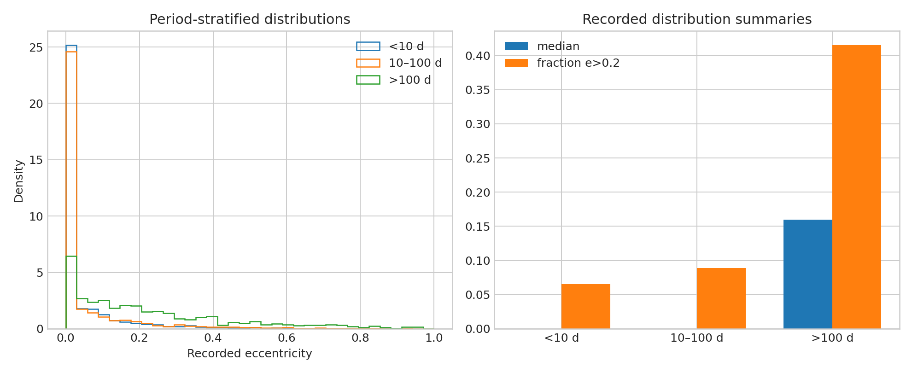

# Exoplanet eccentricity recording audit

**Question:** How strongly does the recorded eccentricity distribution differ between short- and long-period planets?

This executed scientific audit reports provenance, uncertainty or robustness, reusable outputs, and explicit claim limits.

[Open the executed notebook](notebook.ipynb) · [Machine-readable result](result.json)
