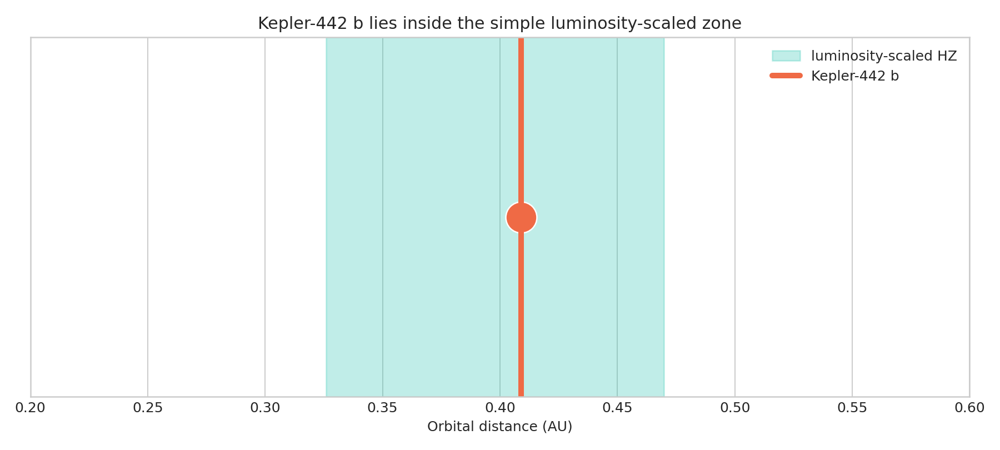

# Kepler-442 b habitable-zone check

The upgraded notebook turns the original calculation into a labelled orbital
figure and tests the result against a ±10% change in stellar luminosity. The
planet remains inside this simple zone, but that is not proof of habitability.

[Open the executed notebook](notebook.ipynb)
