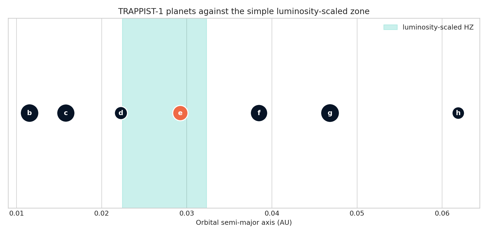

# TRAPPIST-1 habitable-zone check

This corrected analysis plots all seven real archive planets and states exactly
what the simplified model selects: **planet e only**. The earlier prose implied
that e, f, and g passed even though its own calculation selected only e.

[Open the executed notebook](notebook.ipynb)
