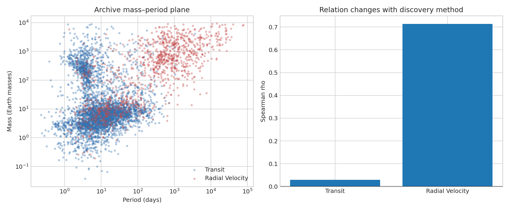

# Planet mass–period selection audit

**Question:** Does the mass–period rank relation persist within the two leading discovery methods?

This executed scientific audit reports provenance, uncertainty or robustness, reusable outputs, and explicit claim limits.

[Open the executed notebook](notebook.ipynb) · [Machine-readable result](result.json)
