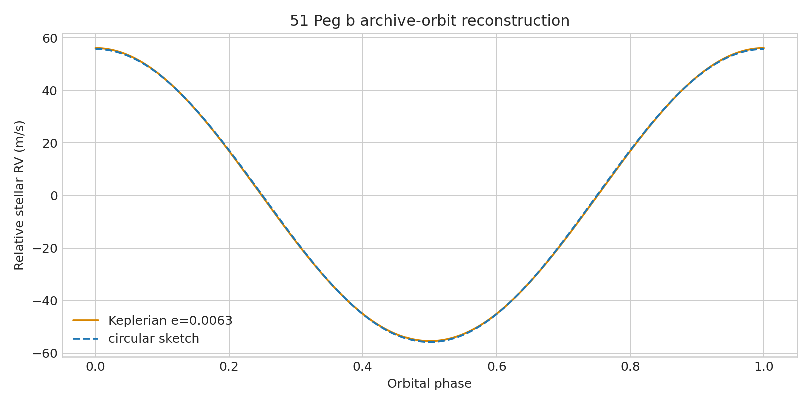

# 51 Peg b Keplerian radial-velocity audit

**Question:** What does the archive orbital solution predict, and how different is it from the old circular sketch?

This executed scientific audit reports provenance, uncertainty or robustness, reusable outputs, and explicit claim limits.

[Open the executed notebook](notebook.ipynb) · [Machine-readable result](result.json)
