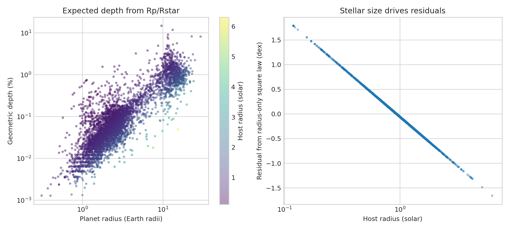

# Geometric transit-depth scaling audit

**Question:** How much of the expected transit-depth variation is explained by planet radius after accounting for host-star radius?

This executed scientific audit reports provenance, uncertainty or robustness, reusable outputs, and explicit claim limits.

[Open the executed notebook](notebook.ipynb) · [Machine-readable result](result.json)
