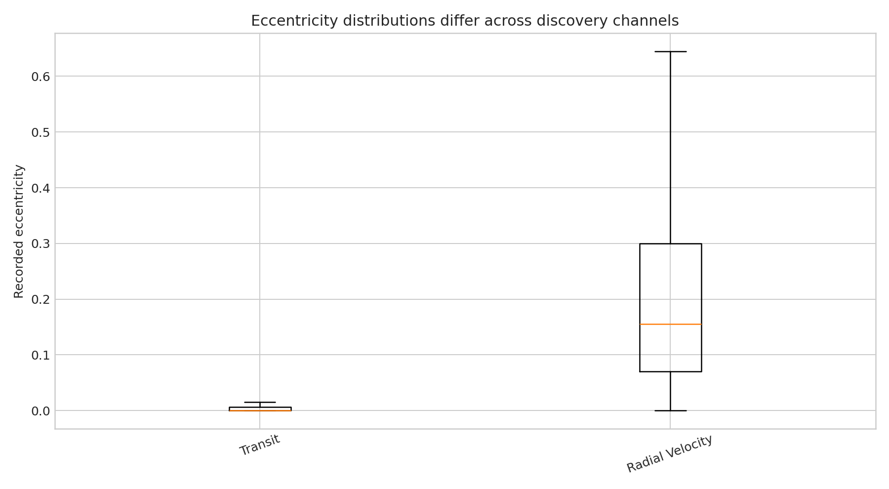

# Exoplanet eccentricity and discovery-method bias

**Question:** Do radial-velocity and transit discoveries have the same recorded eccentricity distribution?

This executed notebook uses the real public-archive subset preserved at
`../2026-07-31-hot-jupiter-tidal-circularisation/giant_planet_archive_query.csv`. It includes quality control, a numerical measurement, uncertainty,
a robustness check, interpretation, and explicit limits.

[Open the executed notebook](notebook.ipynb) · [Machine-readable result](result.json)

The notebook ends with archive documentation and comparison literature used to
frame the physical interpretation and its limits.
