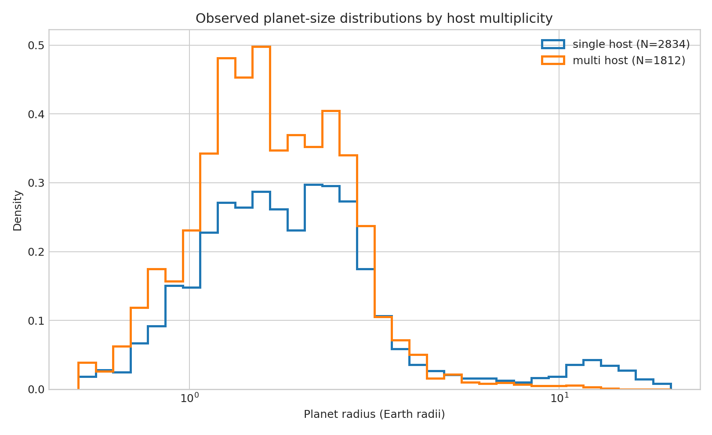

# Planet sizes in single- and multi-transiting systems

**Question:** Does the archive show different radius distributions for hosts with one versus multiple transiting planets?

This executed notebook uses the real public-archive subset preserved at
`../2026-07-31-exoplanet-radius-valley/confirmed_transiting_planets.csv`. It includes quality control, a numerical measurement, uncertainty,
a robustness check, interpretation, and explicit limits.

[Open the executed notebook](notebook.ipynb) · [Machine-readable result](result.json)

The notebook ends with archive documentation and comparison literature used to
frame the physical interpretation and its limits.
