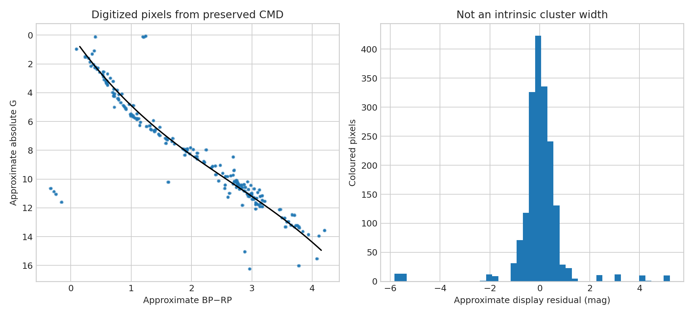

# Hyades legacy CMD evidence audit

**Question:** What quantitative information survives in the first-day Hyades plot when the source rows were not saved?

This executed scientific audit reports provenance, uncertainty or robustness, reusable outputs, and explicit claim limits.

[Open the executed notebook](notebook.ipynb) · [Machine-readable result](result.json)
