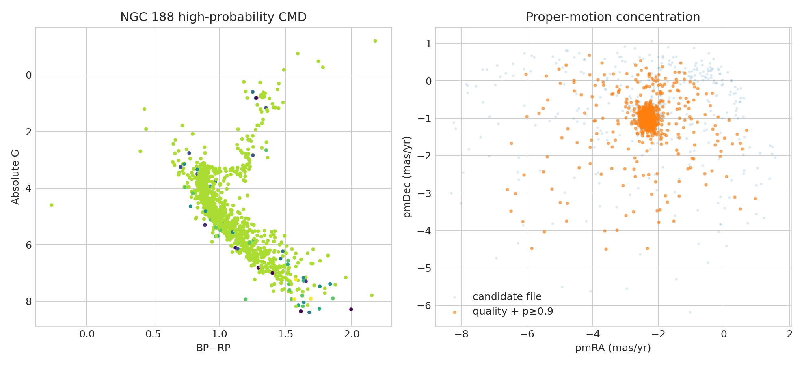

# NGC 188 membership and sequence audit

**Question:** How do probability and astrometric-quality cuts change the old cluster sequence and distance?

This executed scientific audit reports provenance, uncertainty or robustness, reusable outputs, and explicit claim limits.

[Open the executed notebook](notebook.ipynb) · [Machine-readable result](result.json)
