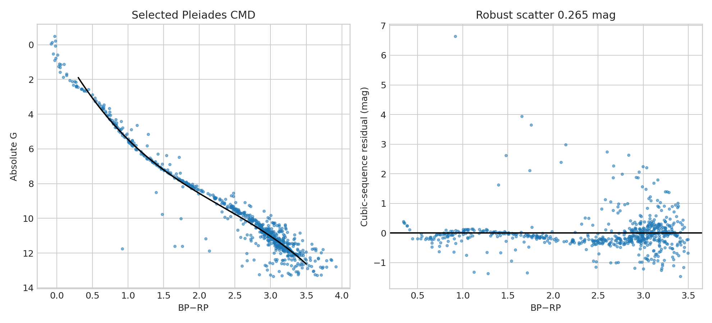

# Pleiades Gaia colour–magnitude sequence audit

**Question:** How narrow is the selected Pleiades sequence, and how sensitive is it to astrometric quality cuts?

This executed scientific audit reports provenance, uncertainty or robustness, reusable outputs, and explicit claim limits.

[Open the executed notebook](notebook.ipynb) · [Machine-readable result](result.json)
