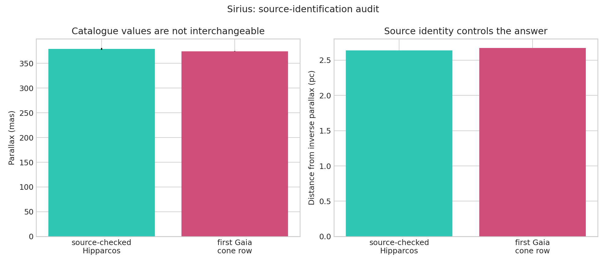

# Sirius parallax source audit

The Gaia cone search returned a faint system source rather than safely identifying Sirius A. The corrected distance uses the source-checked HIP 32349 parallax and keeps the cone row only as an audit comparison.

[Open the executed notebook](notebook.ipynb)
