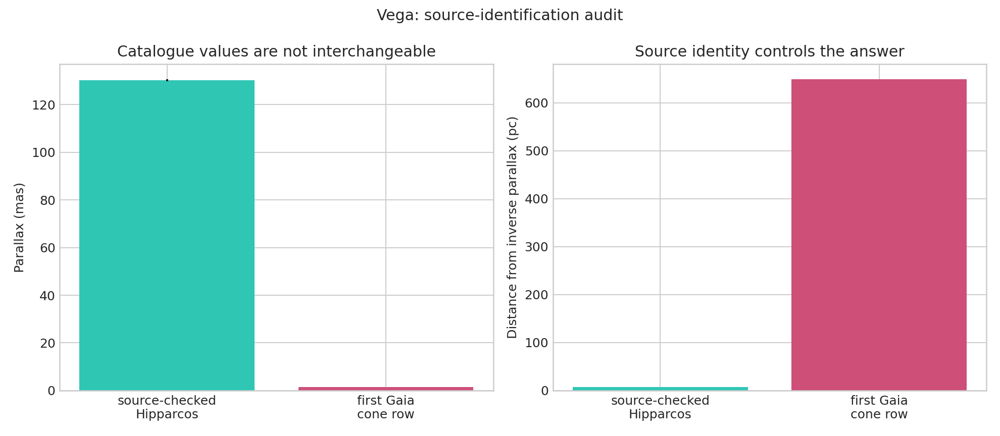

# Vega parallax source audit

The old cone search selected a roughly G=9.67 background source and produced 2,116 light-years, while its prose claimed 25 light-years. This corrected notebook uses the source-checked HIP 91262 value.

[Open the executed notebook](notebook.ipynb)
