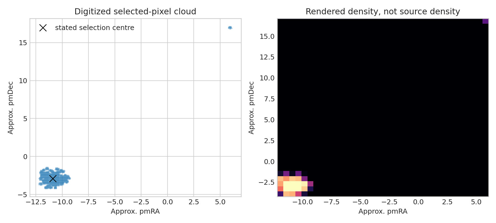

# M67 proper-motion legacy-output audit

**Question:** Does the preserved membership plot centre on the stated M67 motion, and what information is missing?

This executed scientific audit reports provenance, uncertainty or robustness, reusable outputs, and explicit claim limits.

[Open the executed notebook](notebook.ipynb) · [Machine-readable result](result.json)
