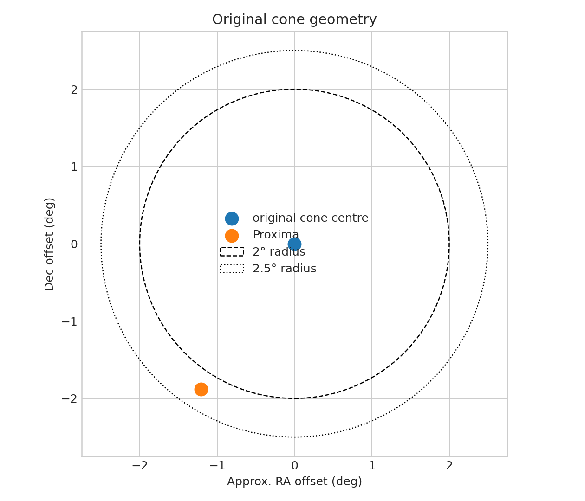

# Why the Alpha Centauri Gaia cone search returned zero

**Question:** Was the original zero-row result a companion constraint or a query-geometry/completeness result?

This executed scientific audit reports provenance, uncertainty or robustness, reusable outputs, and explicit claim limits.

[Open the executed notebook](notebook.ipynb) · [Machine-readable result](result.json)
