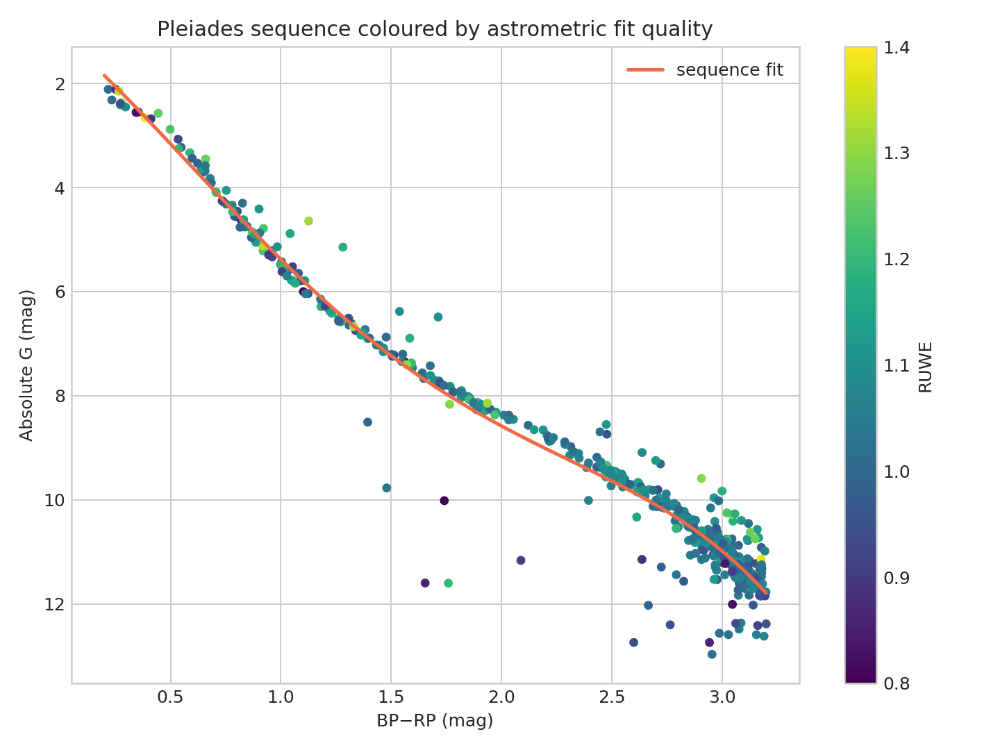

# Pleiades colour–magnitude outliers and Gaia RUWE

**Question:** Are stars above the fitted single-star sequence more likely to have elevated RUWE?

This executed notebook uses the real public-archive subset preserved at
`../2026-07-31-gaia-pleiades-membership-distance/pleiades_members.csv`. It includes quality control, a numerical measurement, uncertainty,
a robustness check, interpretation, and explicit limits.

[Open the executed notebook](notebook.ipynb) · [Machine-readable result](result.json)

The notebook ends with archive documentation and comparison literature used to
frame the physical interpretation and its limits.
