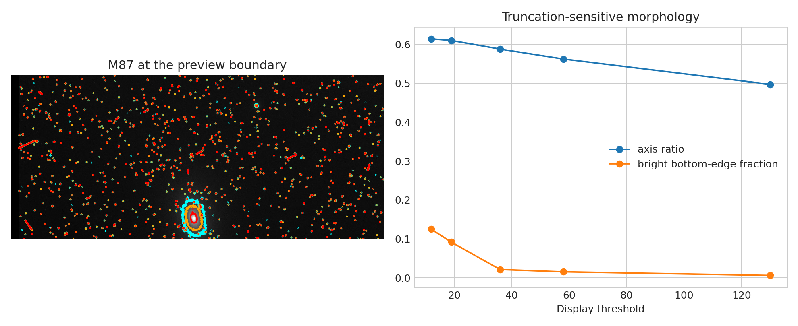

# HST M87 preview field-placement audit

**Question:** Can the selected HST preview support morphology or jet claims when M87 lies at the frame boundary?

This executed scientific audit reports provenance, uncertainty or robustness, reusable outputs, and explicit claim limits.

[Open the executed notebook](notebook.ipynb) · [Machine-readable result](result.json)
