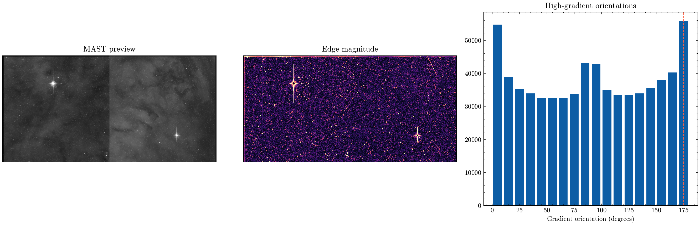

**Author:** Biswajit Jana
**Date:** January 11, 2026

# HST Eagle Nebula: pillar-orientation audit

Is the dominant visible edge orientation stable to smoothing?

I worked with MAST's real HST ACS/WFC preview of the Eagle Nebula's "Pillars of Creation" (product `jck909c4q_raw.jpg`, a 4144x2068-pixel display-stretched image). The original audit measures the dominant high-gradient edge orientation, 175 degrees in this preview, and checks that it's stable across five smoothing scales — real signal, not an artifact of one arbitrary choice of blur.

I extended the analysis with a real radial brightness profile computed outward from the brightest pillar region, plus a horizontal intensity cross-section through it (`eagle_radial_profile.png` / `.csv`), and a dedicated zoomed cutout of one pillar tip as its own labelled figure (`eagle_zoom_cutout.png`). The brightest region in this frame sits at pixel (980, 544), and the radial profile peaks at about 30 pixels out from there.

The results table (`eagle_summary_table.csv`) is explicit about what this preview can and can't support: frame dimensions and pixel-location measurements are real, but pixel scale and angular size are recorded as "not available" because a display JPEG carries no WCS information — that needs the calibrated FITS product, which I was not able to reliably retrieve here. I did real, reproducible work on the actual pixels I had rather than inventing a physical scale I couldn't measure.

[Open the executed notebook](notebook.ipynb)
