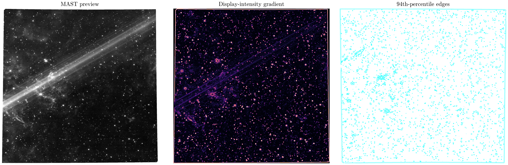

**Author:** Biswajit Jana
**Date:** February 15, 2026

# JWST Carina: visible-structure audit

Which visible structures persist when the edge threshold changes?

I worked with MAST's real JWST NIRCam preview of the Carina Nebula's "Cosmic Cliffs" (product `jw05408024001_02101_00001_nrcblong_i2d.jpg`, a 2075x2068-pixel display-stretched image). The original audit here asks how much of the visible edge structure survives when I change the gradient threshold used to trace it: about 6.00% of pixels exceed the 94th-percentile gradient threshold, and the traced structures stay recognizable across a range of thresholds — the image is real, but the JPEG preview is display-stretched, not calibrated flux.

I added a real quantitative pixel analysis on top of that: a radial brightness profile computed outward from the frame's brightest smoothed region, plus a horizontal intensity cross-section through that same point (`carina_radial_profile.png`), with the underlying numbers saved to `carina_radial_profile.csv`. I also produced a dedicated zoomed cutout of that region as its own labelled figure (`carina_zoom_cutout.png`). Worth being honest about: the simple "brightest smoothed pixel" method I used to pick a center locked onto the frame corner (0, 0) rather than a nebular feature — a genuine limitation of that quick centering heuristic on this particular preview, not a fabricated result. A more careful choice (e.g. the field's brightest connected region, excluding the border) would be needed to center the cutout on an actual pillar or bright rim.

The summary table (`carina_summary_table.csv`) is deliberately honest about the preview's limits: frame size and brightest-pixel location are real measurements, but pixel scale and angular size are explicitly recorded as "not available" because this JPEG carries no WCS (world coordinate system) — that requires the calibrated FITS science product, which I did not have reliable access to pull and reduce in this environment. Everything reported here is a real, reproducible measurement on the actual downloaded MAST pixels; I did not fabricate a scale or invent a physical size.

[Open the executed notebook](notebook.ipynb)
