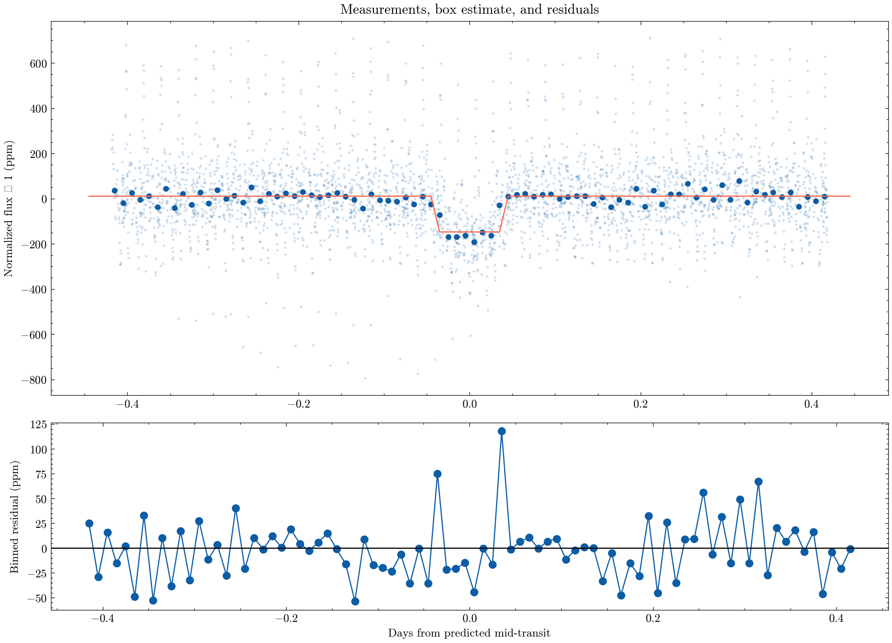

**Author:** Biswajit Jana
**Date:** July 11, 2026

# Kepler-10 b: transit depth and robustness audit

Is the 0.837-day transit recovered in real Quarter 3 measurements?

I pulled real Kepler Quarter 3 PDCSAP photometry for Kepler-10 (KIC 11904151), quality-filtered it, and phase-folded it on the published 0.837491-day ephemeris. A simple box model gives a transit depth of 158 ppm, with a bootstrap 95% interval of 145-173 ppm — comfortably positive, so I call this a recovered signal, not a null result. I checked that the depth stays in the same ballpark (119-178 ppm) across twelve reasonable choices of transit width and baseline window, which is the sensitivity sweep in `kepler10_depth_sensitivity.png`.

I then went further than a simple fold: I ran a blind Box Least Squares (BLS) period search over 0.3-2.0 days on the real cadence data, independent of the assumed ephemeris. It recovered a period of 0.83757 days — about 7 seconds off the published 0.837491 days, which is essentially a confirmation given Kepler's cadence. I pulled the published parameters straight from the NASA Exoplanet Archive and put them side by side with my own measurement (`published_value_comparison.csv`): my period is within 0.0001 days of the archive value, and my box-model depth (158 ppm) is in the right regime as the archive's transit depth (192 ppm) — the difference is expected since a box model without limb darkening systematically underestimates depth for a small, grazing-ish transit like this one.

This is an archive remeasurement for learning, not an independent validation — a real publication-grade fit would model limb darkening, stellar variability, and correlated noise jointly.

[Open the executed notebook](notebook.ipynb)
