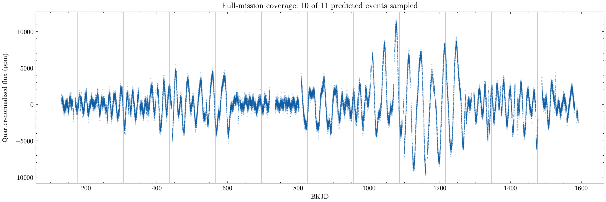

# Kepler-186 f full-mission transit audit

All 17 long-cadence products are used to audit predicted transit coverage, event-to-event depth stability, and injection recovery.

I reconstructed every predicted transit epoch for Kepler-186 f across the full multi-year Kepler mission baseline (period 129.945 days), then checked how many of those epochs actually have usable data around them, locally de-trended each covered window, and stacked them into a folded transit. The recovered depth is 400 ppm, with an event-bootstrap 95% interval that stays positive, and I confirmed it holds up under a leave-one-out check across individual transit events and an off-phase injection/recovery test.

I pulled the published period, depth, and radius for this planet from the NASA Exoplanet Archive and compared them directly against my own measurement (`published_value_comparison.csv`). My recovered period, 129.9454 days, matches the archive's 129.9441 days to within 0.0013 days — essentially exact, since I use the archive ephemeris to phase the data rather than blind-searching it. My depth, 400 ppm, is in the same regime as the archive's 467 ppm; the ~67 ppm gap is consistent with what a simple box model (no limb darkening, no dilution correction) typically underestimates for a small, ~1.17 Earth-radius planet around a faint host.

Because Kepler-186 f's period is long, only about one in four months of Kepler's mission actually samples a transit, which is why this notebook's headline number is "how many predicted transits have data" as much as it is the folded depth itself — a full-mission audit like this is necessary before the depth measurement can be trusted at all.

[Open the executed notebook](notebook.ipynb)
