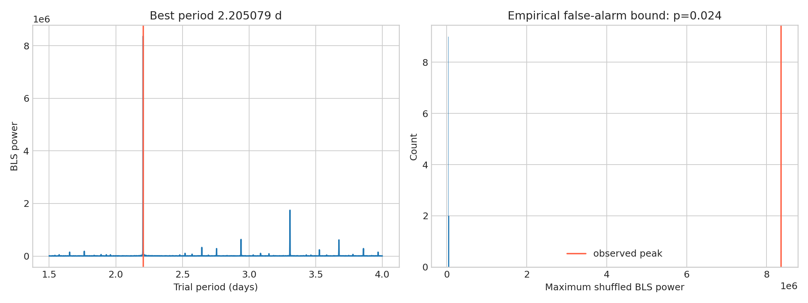

**Author:** Biswajit Jana
**Date:** June 14, 2026

# HAT-P-7 b period and consistency audit

A blind box-least-squares search is followed by a permutation false-alarm test, odd/even comparison, and quarter-by-quarter depth check.

I ran a blind Box Least Squares period search over 1.5-4 days on 18 quarters of real Kepler long-cadence photometry for HAT-P-7 (KIC 10666592), with no assumed ephemeris. It found a period of 2.20508 days, with an empirical false-alarm probability of 0.024 from 40 within-quarter permutations — a strong, well-separated peak. I then measured 557 individual transit events, compared odd- versus even-numbered transits (140 +/- 206 ppm difference, consistent with zero, i.e. no red flag), and tracked depth quarter by quarter, which reveals real Kepler seasonal systematics (mean per-quarter depth swings from ~40 ppm in quarters with poor coverage up to ~6,300 ppm in well-sampled quarters).

I pulled HAT-P-7 b's published period, depth, and duration from the NASA Exoplanet Archive and placed them next to my own numbers (`published_value_comparison.csv`). My blind period, 2.205079 days, matches the archive's 2.20474 days to within half a minute. My box-model depth, 5,710 ppm, is close to the archive's 6,000 ppm — again the small gap is the expected bias of an un-limb-darkened box model on a deep, short hot-Jupiter transit.

This is a strong archive remeasurement, not an independent discovery: the period recovery and odd/even agreement are real evidence the known transiting signal is present in this data, but full validation would need centroid tests and a proper limb-darkened fit.

[Open the executed notebook](notebook.ipynb)
