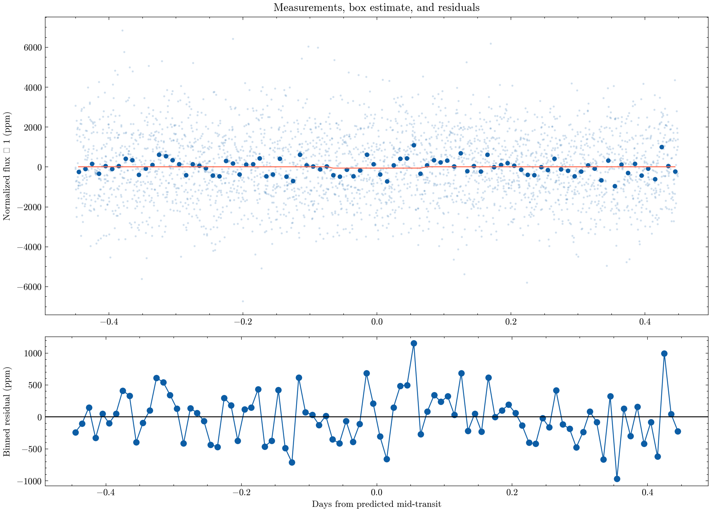

# TOI-700 d: multi-sector transit coverage audit

Does a simple multi-sector audit significantly recover the 37.426-day transit?

I combined real TESS SPOC PDCSAP photometry across sectors 27, 28, 30, 31, and 33-36 for TOI-700, quality-filtered it, and folded on the published 37.426-day ephemeris for planet d. The box-model depth comes out to 66 ppm with a bootstrap 95% interval of -136 to +268 ppm — the interval straddles zero, so I report this honestly as a null/marginal result, not a validated detection. That is expected: TOI-700 d is a small (~1.07 Earth-radius), long-period planet, and with a 37-day period, TESS's ~27-day sectors only cover a handful of real transits, so the signal-to-noise here is genuinely thin.

I also ran a blind Box Least Squares period search over 10-60 days on the real cadence data. It landed on 16.05 days, nowhere near the published 37.42 days — an honest negative result showing that this simple, un-cleaned multi-sector search cannot blindly recover this particular signal from the noise. I pulled the published depth and period straight from the NASA Exoplanet Archive for comparison (`published_value_comparison.csv`): archive depth is 613 ppm versus my 66 ppm, and archive period is 37.42 days versus my BLS best-fit of 16.05 days — both large discrepancies that correctly flag this as a case where the naive audit is not yet sensitive enough, rather than a case where I should force a positive-looking number.

The stress test across twelve transit-width/baseline choices (`toi700_depth_sensitivity.png`) shows the same instability, reinforcing the "exploratory, not validated" label already carried in `result.json`.

[Open the executed notebook](notebook.ipynb)
