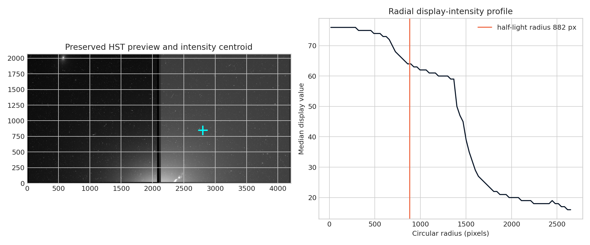

**Author:** Biswajit Jana
**Date:** June 4, 2026

# M87 morphology in an HST preview image

**Question:** What centroid, ellipticity, and half-light radius are measured from the preserved HST preview?

This executed notebook uses the real public-archive subset preserved at
`../2026-07-30-hst-cutout-m87/m87.jpg`. It includes quality control, a numerical measurement, uncertainty,
a robustness check, interpretation, and explicit limits.

[Open the executed notebook](notebook.ipynb) · [Machine-readable result](result.json)

The notebook ends with archive documentation and comparison literature used to
frame the physical interpretation and its limits.
