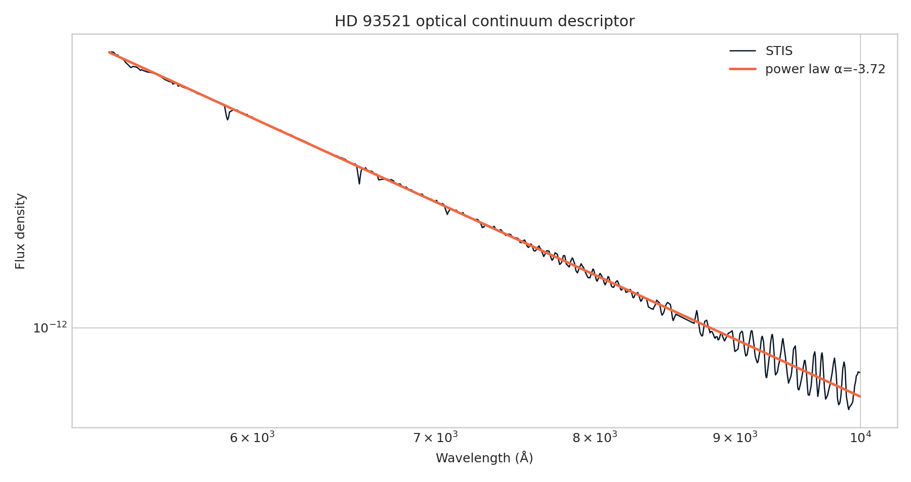

**Author:** Biswajit Jana
**Date:** February 13, 2026

# Optical continuum slope of HD 93521 with HST/STIS

**Question:** What power-law slope describes the calibrated optical continuum after masking strong lines?

This executed notebook uses the real public-archive subset preserved at
`../2026-07-31-hst-stis-hd93521-line-inventory/spectrum_subset.csv`. It includes quality control, a numerical measurement, uncertainty,
a robustness check, interpretation, and explicit limits.

[Open the executed notebook](notebook.ipynb) · [Machine-readable result](result.json)

The notebook ends with archive documentation and comparison literature used to
frame the physical interpretation and its limits.
