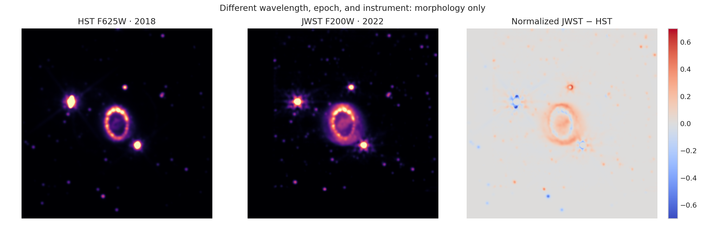

# SN 1987A Hubble–Webb structure comparison

Calibrated HST and JWST cutouts are registered by WCS and tested across common smoothing scales. The comparison is morphological, not cross-band photometry.

[Open the executed notebook](notebook.ipynb)
