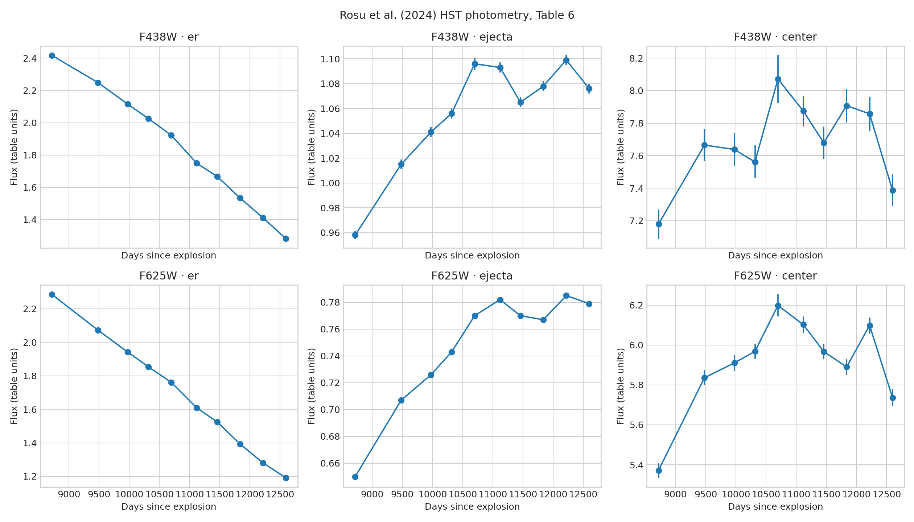

# SN 1987A HST optical light-curve reproduction

The peer-reviewed HST F438W and F625W table is independently reanalysed with residual-bootstrap trends and a sampled change-point test.

[Open the executed notebook](notebook.ipynb)
