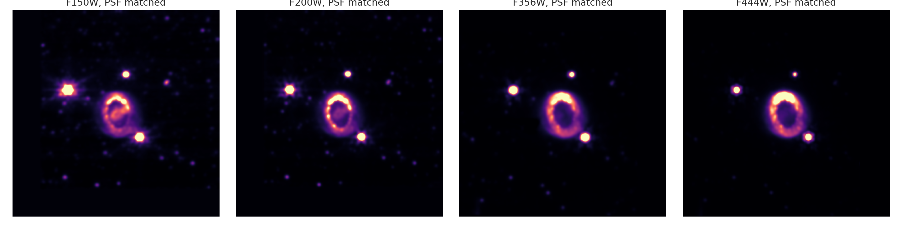

# JWST SN 1987A filter-dependent morphology

Four calibrated NIRCam filters are WCS-aligned, approximately PSF-matched, background-subtracted, and tested across aperture choices.

[Open the executed notebook](notebook.ipynb)
