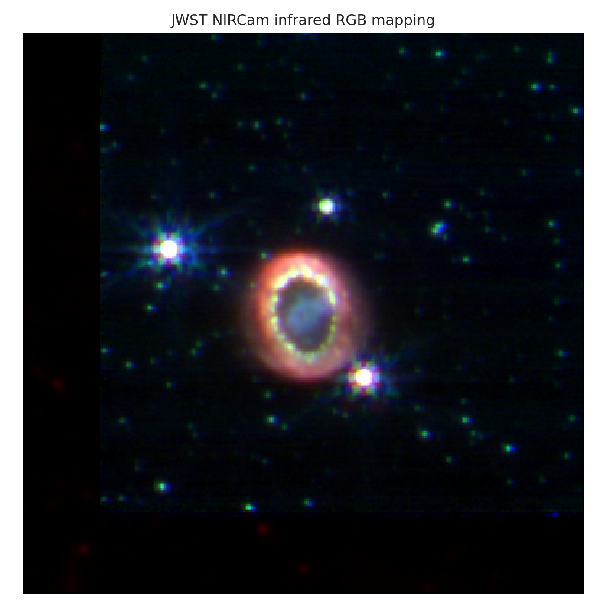

**Author:** Biswajit Jana
**Date:** June 23, 2026

# JWST SN 1987A calibrated infrared RGB

Three calibrated NIRCam mosaics are registered by WCS and mapped into a documented false-colour RGB image.

[Open the executed notebook](notebook.ipynb)
