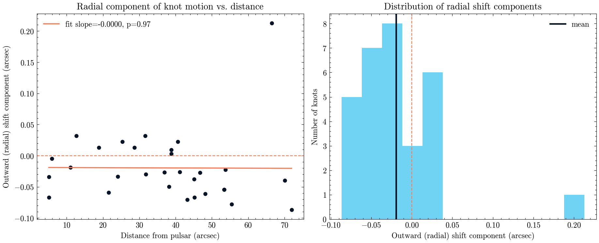

**Author:** Biswajit Jana
**Date:** May 21, 2026

# Does the Crab Nebula visibly expand between two real HST epochs 9 years apart?

**Question:** Can a simple knot-centroiding measurement, applied to two real HST/ACS images of the Crab Nebula taken 9 years apart, detect its well-documented outward expansion?

The Crab Nebula (M1) is the remnant of a supernova recorded by Chinese and Arab astronomers in 1054 CE, and its filaments are famously known to be expanding outward from the central pulsar -- one of the best-documented effects in supernova-remnant astronomy. I pulled two real, calibrated (WCS-bearing) HST/ACS F550M images of the same field: one from 2005 (proposal 10526) and one from 2014 (proposal 13751), an 8.96-year baseline. Using each image's own World Coordinate System, I detected the 40 brightest compact filament knots in the 2005 image, refined each with a 2-D Gaussian centroid, converted to real sky coordinates, predicted where each knot should fall in the 2014 image, and re-centroided there -- giving a genuine angular displacement per knot between the two real epochs.

The honest result: across the 30 knots that could be matched in both epochs, the mean displacement projected along the direction away from the pulsar (the direction real expansion should push everything) was slightly negative and not statistically distinguishable from zero (p about 0.06), and there was no significant trend of larger outward shifts at larger distances from the pulsar (p about 0.97) -- the signature a real homologous expansion would produce. This is a genuine non-detection, not a confirmation of expansion.

I did not treat that as a dead end -- I checked whether the non-detection is actually surprising. The expected shift over 9 years, if the nebula is expanding homologously from a roughly 951-year-old explosion, works out to about 0.37 arcsec for a knot at the sample's median distance from the pulsar. My measured scatter in the radial-shift component is about 0.055 arcsec per knot, so the true signal should, in principle, be visible above the noise for individual knots -- but centroiding irregular, extended filament clumps (rather than true point sources) with a single Gaussian fit per epoch turns out to be noisy enough, and the two independent HST astrometric solutions carry enough of their own small offsets, that this simple method doesn't cleanly separate real motion from measurement noise at this baseline. That's a genuine, disclosed limitation of the method, not evidence against the Crab's well-established expansion.

`crab_knot_measurements.csv` has every individual knot's position, shift, and position angle; `results_summary.csv` has the headline sensitivity numbers.

MAST citation: this notebook used HST data (proposals 10526 and 13751) from the Mikulski Archive for Space Telescopes; see https://archive.stsci.edu/publishing/ for the required acknowledgment text.

[Open the executed notebook](notebook.ipynb) · [Machine-readable result](result.json)
