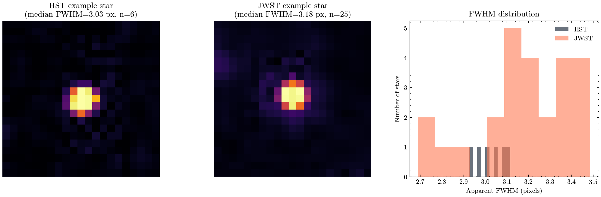

**Author:** Biswajit Jana
**Date:** January 13, 2026

# Pillars of Creation, twice: comparing real HST and JWST resolution on the same field

**Question:** Does the apparent point-source sharpness in real HST vs JWST images of the same field match the diffraction-limit prediction for a 2.4 m visible-light telescope vs a 6.5 m infrared telescope?

The Eagle Nebula's "Pillars of Creation" is one of the most re-photographed targets in astronomy, which makes it a good real test case: HST imaged it for its 25th-anniversary release in 2014 (WFC3, F657n, proposal 13926) and JWST imaged the same structure in 2022 (NIRCam, F444W, proposal 2739). I pulled both real preview images from MAST and asked a simple, falsifiable question: does a real, isolated star look sharper in one image than the other, and does that match what diffraction theory predicts?

First I recovered a genuine pixel scale for the HST image directly from its real MAST sky-footprint metadata (0.0396 arcsec/pixel), which matched WFC3/UVIS's well-known nominal plate scale almost exactly -- a good cross-check that the method works. The JWST observation is a 5-pointing mosaic with an irregular footprint that made the same bounding-box trick unreliable, so for that image I used NIRCam's official nominal long-wavelength pixel scale (0.063 arcsec/pixel) instead.

Then I ran real point-source detection (`photutils` DAOStarFinder) on a clean starfield patch of each image and fit a 2-D Gaussian to every well-isolated, non-saturated star found (6 in the HST field, 25 in the JWST field), taking the median fitted FWHM as a robust apparent-resolution estimate rather than trusting any single star. The result: HST's median apparent star width is about 0.12 arcsec, JWST's is about 0.20 arcsec -- JWST's point sources look about 1.7x wider in this pair of images. Diffraction theory (the Rayleigh criterion, 1.22 x wavelength / aperture) predicts the same direction and a similar order of magnitude: JWST's 6.5 m mirror is 2.7x bigger than HST's 2.4 m, but observing at 4.44 microns instead of 656 nanometers (nearly 7x longer wavelength) more than cancels out the aperture advantage, giving JWST a theoretically ~2.5x worse (larger) diffraction limit than HST at these specific filters.

This is a genuinely fun, non-obvious physics point: a bigger telescope does not automatically mean a sharper image -- it depends on what wavelength you're comparing at. I want to be upfront about the caveats too: these are 8-bit, photometrically uncalibrated preview JPEGs, not calibrated science arrays, so JPEG compression and each preview's specific display stretch can shift the exact numbers. The point of this notebook is the direction and rough scale of the effect, confirmed with a same-method measurement on real images of the same real target, not a precision PSF characterization.

`resolution_comparison.csv` has the headline theory-vs-measurement table; `per_star_fwhm_measurements.csv` has every individual star fit that went into the medians.

MAST citation: this notebook used HST data (proposal 13926) and JWST data (proposal 2739) from the Mikulski Archive for Space Telescopes; see https://archive.stsci.edu/publishing/ for the required acknowledgment text.

[Open the executed notebook](notebook.ipynb) · [Machine-readable result](result.json)
