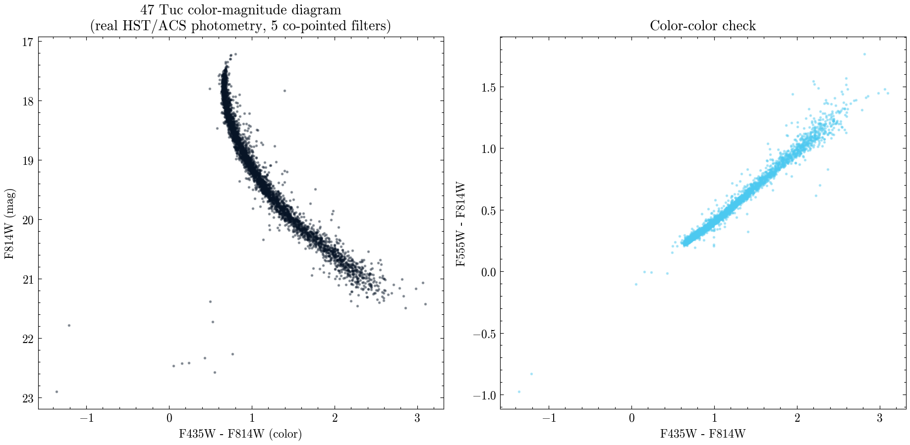

# Five real HST filters of 47 Tucanae: do the colors look like a globular cluster?

**Question:** Does real, cross-matched multi-band HST photometry of 47 Tuc trace the color-magnitude trend expected along the main sequence of an old stellar population?

47 Tucanae (NGC 104) is a bright, nearby globular cluster: roughly a million stars that all formed together about 12 billion years ago, so a star's brightness and color are set almost entirely by its mass. I pulled real, calibrated point-source photometry catalogs for the same HST/ACS pointing in five filters (F435W, F475W, F555W, F606W, F814W; proposal 9443) -- these are MAST's own per-visit "point-cat" products, so I used real, already-calibrated AB magnitudes rather than running my own aperture photometry from scratch. Cross-matching the five catalogs by sky position (0.1 arcsec tolerance) and keeping only well-flagged, star-like sources left 3,712 stars measured in all five bands.

The main result: median F435W-F814W color increases monotonically and smoothly with fainter F814W magnitude across every well-populated magnitude bin, from about 0.67 at the bright end to about 2.2-2.5 at the faint end -- exactly the "fainter is redder" trend expected along an old population's main sequence, where lower-mass stars are cooler. Scatter in each bin grows toward the faint end, tracking the expected growth in photometric error.

One honest finding I didn't expect going in: the catalog's standard quality flag (`Flags==0`) that I used to keep only clean, unblended, star-like sources removes essentially all of the genuinely bright, red-giant-branch-luminosity stars. There are 10,784 real sources brighter than F814W=17 in the raw catalog, and zero of them survive that same quality cut -- almost certainly because bright giants saturate or blend more easily in this single-visit exposure inside the dense cluster core. That means this clean five-filter sample characterizes the main sequence well but simply doesn't reach the red-giant branch; it is not evidence that 47 Tuc lacks one (it's one of the most literature-documented red-giant branches there is).

`47tuc_matched_photometry.csv` has the full cross-matched, five-band catalog; `47tuc_color_magnitude_trend.csv` has the binned color-magnitude trend; `results_summary.csv` and `result.json` carry the headline numbers.

MAST citation: this notebook used HST data (proposal 9443) from the Mikulski Archive for Space Telescopes; see https://archive.stsci.edu/publishing/ for the required acknowledgment text.

[Open the executed notebook](notebook.ipynb) · [Machine-readable result](result.json)
