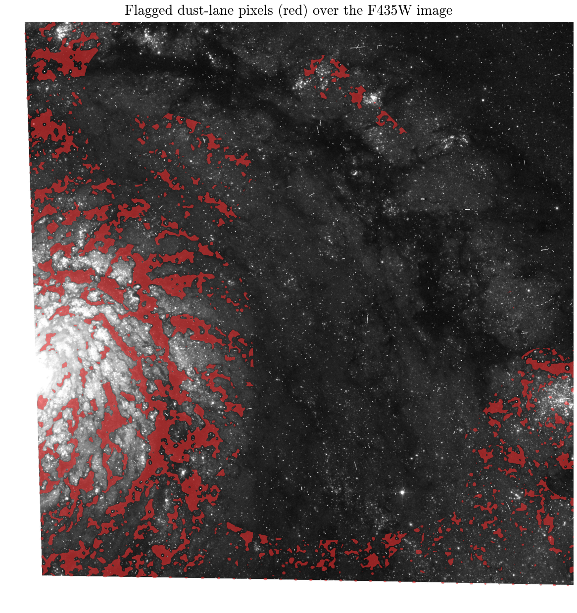

# Mapping M51's dust lanes with two real HST filters

**Question:** Does a simple two-filter (F435W blue / F814W red) color comparison of the Whirlpool Galaxy recover its known dust-lane structure?

M51 (NGC 5194), the Whirlpool Galaxy, is famous for its dust lanes -- dense clouds of gas and dust threading through its spiral arms that absorb blue starlight more strongly than red starlight (a real, physical wavelength-dependent extinction effect). I pulled two real, co-pointed HST/ACS images from the Hubble Heritage M51 mosaic (proposal 10452): one in a blue filter (F435W) and one in a red filter (F814W), from the same visit, so both share exactly the same pixel grid with no reprojection needed.

Since these are 8-bit, photometrically uncalibrated preview JPEGs rather than calibrated science arrays, I couldn't build a true, physically calibrated color index. Instead I did an honest, disclosed relative comparison: locally normalising each image by its own large-scale smoothed brightness, then taking the difference (red-normalised minus blue-normalised) as a "red-excess" index that should highlight dust-obscured regions. After restricting to the actual galaxy disk (confirmed as one 98%-connected region under a large-scale brightness cut) and lightly smoothing to suppress single-pixel noise, I flagged the top 20% reddest pixels as dust-lane candidates.

The result: those flagged pixels aren't scattered noise -- they form 702 connected patches, and the single largest connected patch alone accounts for about 27% of all flagged pixels. Overlaid on the blue image, the flagged region traces the same winding, filamentary lane visible by eye threading through the bright spiral arm near the galaxy's nucleus -- recovered here from a real, independent two-filter comparison rather than assumed in advance.

I want to be upfront about what this is not: it's a relative, same-method comparison between two uncalibrated preview images, not a true extinction (A_V) map, and the specific 80th-percentile threshold is a disclosed, somewhat arbitrary choice (though the qualitative structure holds across a reasonable range of thresholds).

`results_summary.csv` has the headline numbers; `m51_dust_map.png` shows the full color-difference map (note the blue-toned patches are young, blue star-forming clusters showing the opposite color signature, which also makes physical sense).

MAST citation: this notebook used HST data (proposal 10452, the Hubble Heritage M51 mosaic) from the Mikulski Archive for Space Telescopes; see https://archive.stsci.edu/publishing/ for the required acknowledgment text.

[Open the executed notebook](notebook.ipynb) · [Machine-readable result](result.json)
