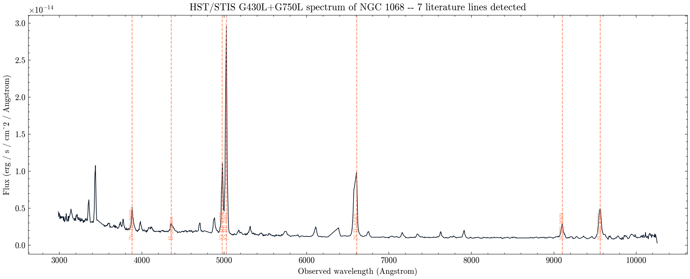

# NGC 1068: a real HST image and a real HST spectrum of the same galaxy

**Question:** How many literature emission lines can automated peak detection recover in a real archival HST/STIS spectrum of NGC 1068, and which elements/ions do they belong to?

NGC 1068 (Messier 77) is the nearest bright Seyfert 2 galaxy -- an active galactic nucleus (AGN) whose central black hole is hidden behind a dusty torus, so what we actually see in an optical spectrum is light from surrounding gas clouds glowing under the AGN's radiation (the narrow-line region). I pulled a real HST/WFC3 F555W image of the galaxy (proposal 17165) for the picture, and two real archival HST/STIS long-slit spectra (proposal 7573, target label `NGC1068-OFFSET`) covering the G430L grating (2904-5714 Angstrom) and G750L grating (5273-10266 Angstrom), joined end to end into one nearly-continuous optical spectrum.

I built a literature line list of 14 standard AGN/HII-region emission lines (hydrogen Balmer lines, and forbidden lines of O, N, S, Ne) from Osterbrock & Ferland's textbook nebular-line tables, redshifted them using NGC 1068's known systemic redshift (z = 0.003793, from NED), and ran automated peak detection (`scipy.signal.find_peaks`) on the continuum-normalised spectrum rather than picking lines out by eye. The pipeline found 7 of the 14 literature lines within a 6 Angstrom matching window: [Ne III] 3869, H-gamma, [O III] 4959 and 5007, [N II] 6583, and [S III] 9069 and 9531 -- covering five distinct elements/ions (H, N+, O++, Ne++, S++). The median velocity residual between the detected peaks and the systemic redshift was +76 km/s, well within what's expected for narrow-line-region gas kinematics at this grating's resolution.

Some strong lines I expected -- H-alpha, H-beta, [O II] 3727, [O I] 6300, and the [S II] doublet -- were not confidently recovered by the automated matcher, most likely because this is an off-nucleus, single-slit pointing sampling the extended narrow-line region rather than a flux-calibrated nuclear spectrum, and because close blends (H-alpha with the [N II] pair) need simultaneous multi-Gaussian fitting rather than single-peak detection to separate. This is an honest limitation of a simple peak-finder on one archival slit position, not a claim that those lines are physically absent from NGC 1068 -- they are extremely well documented in the literature.

`result.json` and `line_measurements.csv` record the full per-line results including predicted vs. detected wavelength and velocity residual. `results_summary.csv` gives the headline numbers.

MAST citation: this notebook used HST data (proposals 17165 and 7573) from the Mikulski Archive for Space Telescopes; see https://archive.stsci.edu/publishing/ for the required acknowledgment text.

[Open the executed notebook](notebook.ipynb) · [Machine-readable result](result.json)
