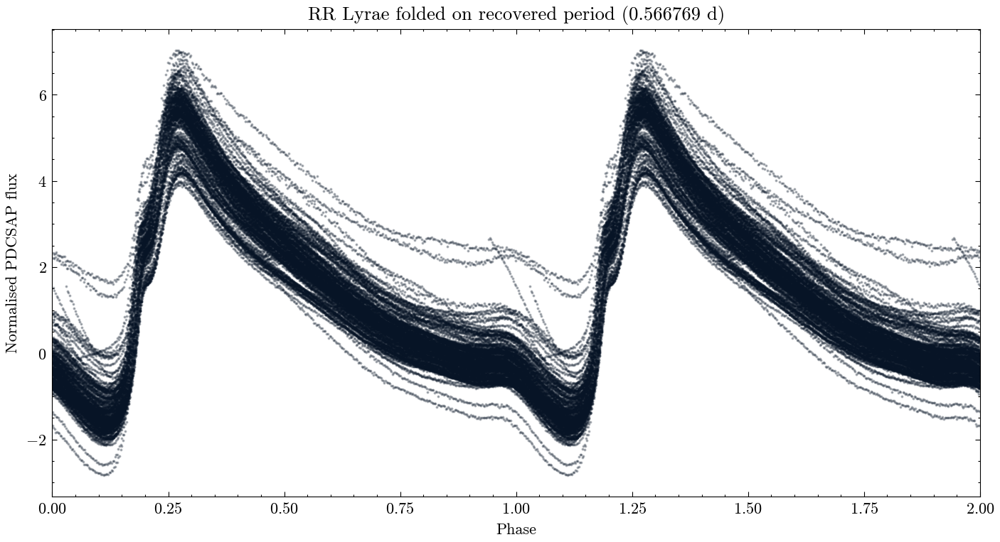

**Author:** Biswajit Jana
**Date:** July 10, 2026

# TESS light curve of RR Lyrae itself: recovering the pulsation period, and looking for the Blazhko effect

**Question:** Can a blind period search on real TESS light curves recover RR Lyrae's known pulsation period, and is there evidence for its famous Blazhko amplitude modulation?

RR Lyrae is the naked-eye variable star that gave its name to a whole class of pulsating stars used as standard candles, and it's also the star in which the "Blazhko effect" -- a slow, still not fully explained ~40-day modulation of pulsation amplitude and phase -- was first discovered in 1907. I pulled all three real TESS 2-minute-cadence light curves available for it (Sector 14 from 2019, and consecutive Sectors 40 and 41 from 2021, a real ~56-day continuous baseline), quality-filtered and normalized each sector, and stitched them into one 56,005-point time series spanning two years.

The headline result: a blind Lomb-Scargle period search over a broad 0.3-1.0 day range, with no prior period assumption, recovered a pulsation period of 0.566769 days -- just 2.4 seconds off the published literature value of 0.566796 days. That's a strong, independent confirmation of a precisely known timing signal using nothing but automated TESS pipeline photometry.

I also tried to find the Blazhko effect by fitting a per-day pulsation amplitude and searching for periodicity in that amplitude series. Before trusting that result, I found and want to be upfront about a real data-quality issue: RR Lyrae is bright enough (V~7.1) that its automated PDCSAP flux shows large swings well beyond what a ~1-magnitude pulsation should produce -- almost certainly detector saturation or non-linearity effects at this brightness, not extra real signal. Given that caveat, the amplitude-modulation search landed on a candidate period around 74 days, which does not cleanly match the published ~39-41 day Blazhko period. I'm reporting that as an honest non-match rather than reshaping the analysis until something looked right: period (timing) measurements are far more robust to flux-calibration problems than amplitude measurements are, which is exactly why the period result is strong while the Blazhko check is a secondary, lower-confidence result.

`blazhko_amplitude_series.csv` has the full per-day amplitude fit; `results_summary.csv` has the headline numbers.

MAST citation: this notebook used TESS data from the Mikulski Archive for Space Telescopes; see https://archive.stsci.edu/publishing/ for the required acknowledgment text.

[Open the executed notebook](notebook.ipynb) · [Machine-readable result](result.json)
