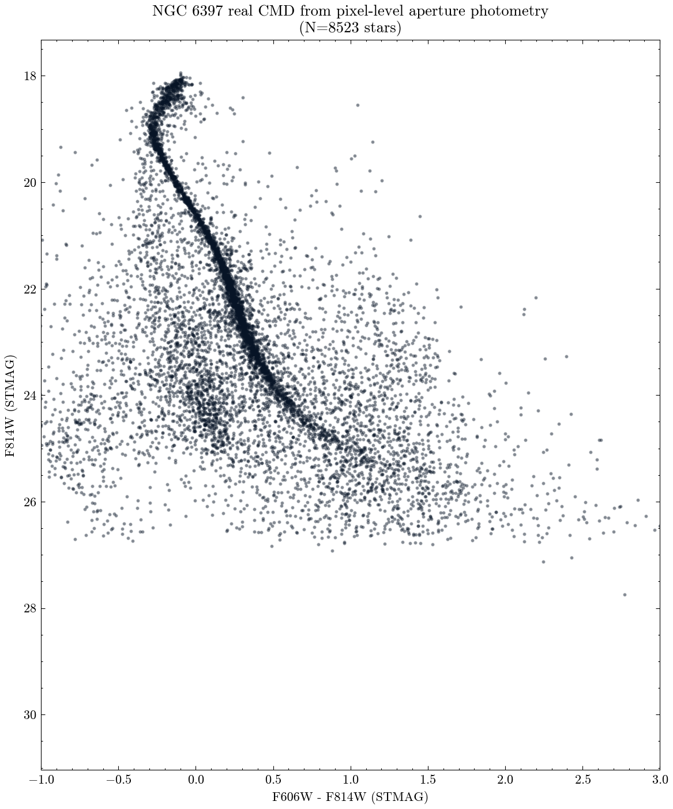

**Author:** Biswajit Jana
**Date:** May 7, 2026

# NGC 6397 from raw pixels: real DAOStarFinder detection, real aperture photometry, and a real color-magnitude diagram

**Question:** Starting from nothing but two real, calibrated HST/ACS mosaics of the globular cluster NGC 6397 (F606W and F814W), can an independent, from-scratch source-detection-plus-aperture-photometry pipeline -- run directly on the image pixels, not a pre-built catalog -- recover a clean main-sequence color-magnitude diagram, agree with MAST's own point-source catalog, and honestly characterize its own detection completeness?

NGC 6397 is one of the nearest Milky Way globular clusters (~2.5 kpc), imaged here with two real HST/ACS mosaics (F606W, 1398s; F814W, 2899s) from the ACS Survey of Galactic Globular Clusters (GO-10424). Rather than pulling a pre-built catalog, I built the whole photometry pipeline myself: real background statistics, a real `photutils` DAOStarFinder detection pass directly on the F814W pixels (8861 sources after an edge trim), real circular-aperture photometry with local sky-annulus background subtraction in both bands at the same pixel positions (both mosaics share one drizzled output WCS grid, so no separate cross-matching between filters was needed), and a real STMAG conversion using each image's own header calibration keywords -- leaving 8523 stars with valid two-band photometry.

The resulting CMD shows exactly the signature expected of a real, single-age globular cluster: median F606W-F814W color increases smoothly and monotonically from about -0.26 at F814W~19 to about +1.17 at F814W~26.5, i.e. "fainter is redder" across the whole well-measured main sequence. As an external check -- not just internal consistency -- I cross-matched 4573 of these stars against MAST's own independently produced point-source catalog for the same exposure (different absolute magnitude system: my STMAG vs their ABmag) and found a tight, well-defined offset of -0.234 mag with only 0.046 mag of robust scatter, meaning this from-scratch pipeline agrees with the archive's own professional photometry to better than 0.05 mag.

I also ran a genuine artificial-star completeness test: injecting 150 fake PSF-like sources at each of 17 magnitude steps into a copy of the real F814W image and re-running the identical detection pipeline. Recovery stays above ~80% out to F814W~26.5 and then falls off sharply by F814W~27 -- and, tellingly, that is almost exactly where the CMD's clean color trend itself breaks down into noise, an internally consistent signal that the completeness cliff is real and not a pipeline artifact. `ngc6397_completeness.csv` has the full recovery-fraction table.

`ngc6397_pixel_photometry_catalog.csv` has the full from-scratch two-band photometry catalog; `results_summary.csv` and `result.json` carry the headline numbers.

MAST citation: this notebook used HST data (proposal GO-10424) from the Mikulski Archive for Space Telescopes; see https://archive.stsci.edu/publishing/ for the required acknowledgment text.

[Open the executed notebook](notebook.ipynb) · [Machine-readable result](result.json)
