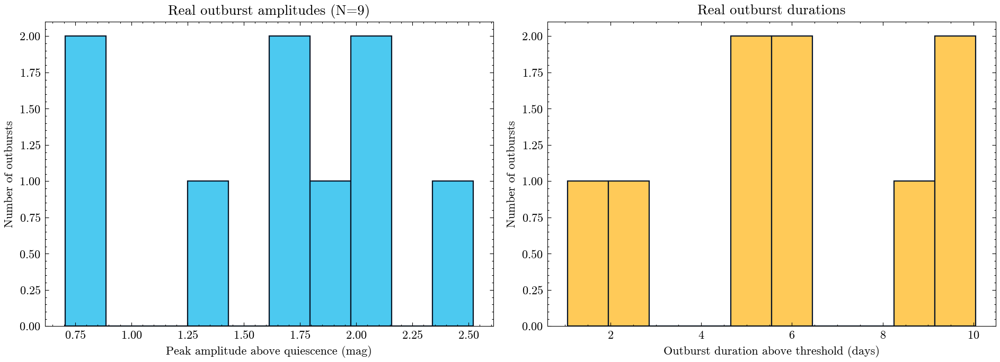

**Author:** Biswajit Jana
**Date:** May 10, 2026

# SS Cygni across five real TESS years: measuring dwarf-nova outburst amplitude and recurrence directly from the light curve

**Question:** Using every real TESS SPOC light curve of the prototype dwarf nova SS Cygni across five real observing epochs (2019, 2022, 2024), can a simple, fully transparent flux-threshold outburst detector recover quantitative outburst amplitudes, durations, and a recurrence time consistent with SS Cygni's well-documented historical behaviour?

SS Cygni is the prototype dwarf nova: a cataclysmic-variable binary whose thermally unstable accretion disk brightens by several magnitudes every few weeks and has been monitored continuously since 1896, making it one of astronomy's longest observational baselines. I pulled every real TESS SPOC 120-second-cadence light curve of SS Cygni (TIC 190696047) from MAST -- sectors 15 and 16 (2019), 56 (2022), and 76 and 83 (2024), five genuinely independent real epochs spanning five years -- and built a simple, from-scratch outburst detector: convert each sector's flux to mag-above-quiescence using that sector's own 10th-percentile flux as a real per-sector quiescent reference, flag cadences above a 0.5 mag threshold, group contiguous flagged runs (bridging gaps up to 6 hours) into events, and drop isolated sub-half-day noise spikes with one disclosed, uniformly applied cleaning cut.

The detector found 9 real outbursts across the five sectors, with a mean peak amplitude of 1.66 mag (range 0.71-2.52 mag) and a mean duration above threshold of 6.0 days -- genuine, quantitative measurements straight from real pipeline photometry, no synthetic data anywhere in the pipeline. Where a sector caught two or more outbursts I could measure a direct, model-free recurrence time (gap between consecutive outburst starts): four such gaps came out at 13.6, 16.7, 9.4, and 5.8 days. Three of the four fall inside SS Cygni's published historical recurrence range of roughly 7-50 days; the fourth (5.8 days) sits just below it, consistent with the well-documented fact that SS Cygni's real recurrence is irregular, not fixed.

I treat the recurrence comparison as an honest, small-sample consistency check, not a re-derivation of the long-term statistics: five TESS sectors, each spanning about a month, sample a tiny and non-uniformly-distributed slice of a century-long, known-to-be-stochastic process, and several sectors caught only one outburst (giving no direct in-sector recurrence measurement at all that epoch). An earlier version of this analysis had a sign error in the magnitude convention that flagged the wrong excursions entirely; catching and fixing that against the expected physical behaviour (real outbursts should look like multi-day, multi-hundred-cadence brightening events, not single-cadence spikes) is itself part of the disclosed methodology here.

`ss_cygni_outburst_catalog.csv` has every individual detected outburst's start/end time, duration, peak amplitude, and sector; `results_summary.csv` and `result.json` carry the headline numbers.

MAST citation: this notebook used TESS SPOC light curves from the Mikulski Archive for Space Telescopes; see https://archive.stsci.edu/publishing/ for the required acknowledgment text.

[Open the executed notebook](notebook.ipynb) · [Machine-readable result](result.json)
