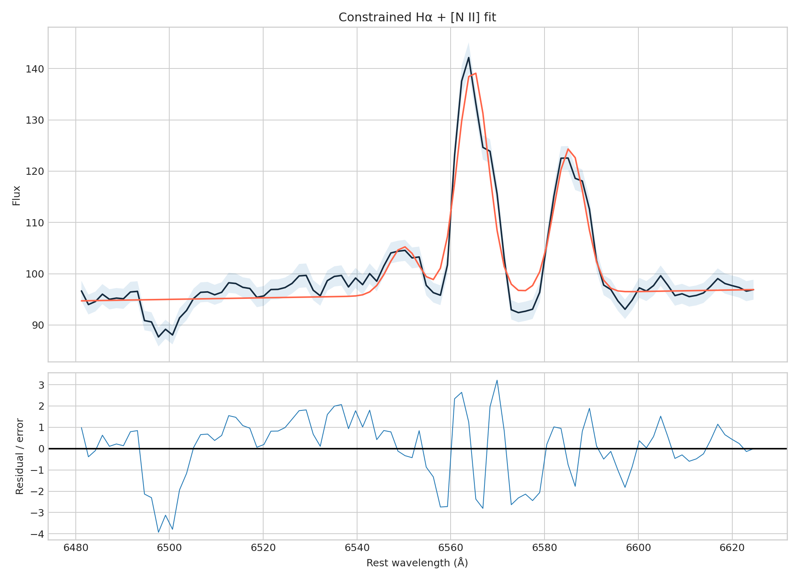

# SDSS galaxy joint Hα + [N II] audit

A constrained three-line fit replaces the old single-Gaussian measurement and corrects its wavelength-unit error.

[Open the executed notebook](notebook.ipynb)
