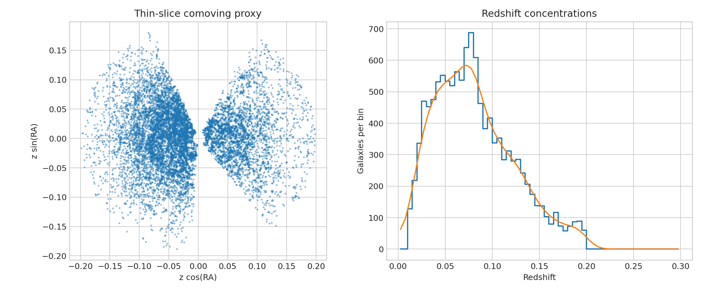

# SDSS redshift-slice structure audit

**Question:** Which redshift concentrations are visible in a preserved 12,000-galaxy SDSS emission-line sample?

This executed scientific audit reports provenance, uncertainty or robustness, reusable outputs, and explicit claim limits.

[Open the executed notebook](notebook.ipynb) · [Machine-readable result](result.json)
