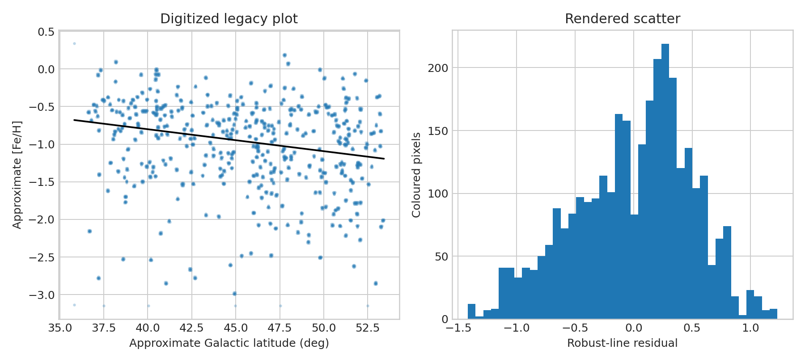

**Author:** Biswajit Jana  
**Date:** March 3, 2026

# SDSS metallicity–latitude legacy-output audit

**Question:** Does the weak negative trend reported in the old plot survive digitization choices?

This executed scientific audit reports provenance, uncertainty or robustness, reusable outputs, and explicit claim limits.

[Open the executed notebook](notebook.ipynb) · [Machine-readable result](result.json)
