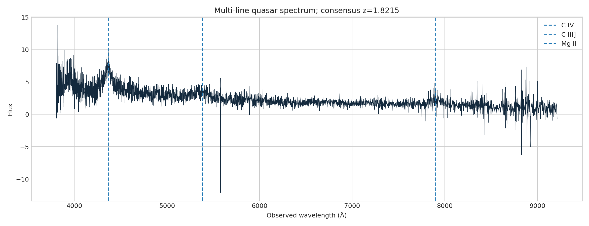

**Author:** Biswajit Jana  
**Date:** June 28, 2026

# SDSS quasar multi-line redshift audit

C IV, C III], and Mg II are measured separately so line-to-line redshift systematics remain visible.

[Open the executed notebook](notebook.ipynb)
