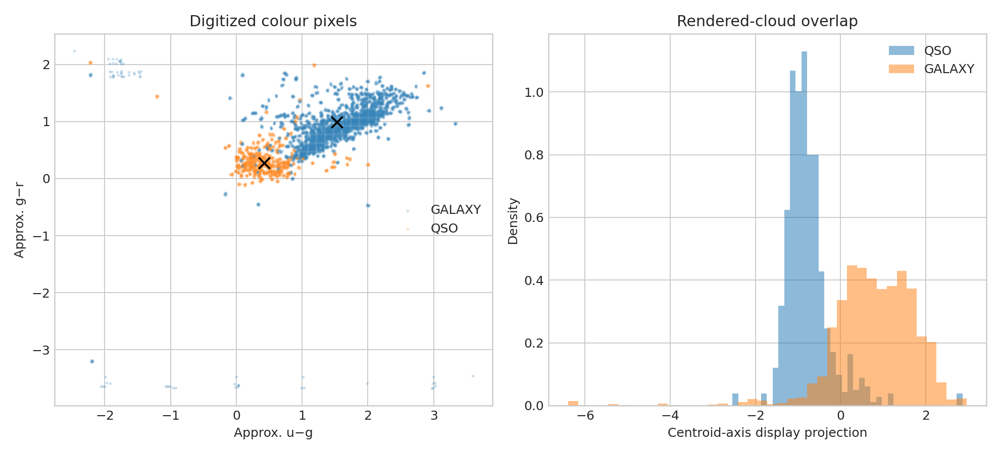

# SDSS quasar–galaxy colour display audit

**Question:** How clearly separated are the two rendered colour clouds, without claiming catalogue-level classifier accuracy?

This executed scientific audit reports provenance, uncertainty or robustness, reusable outputs, and explicit claim limits.

[Open the executed notebook](notebook.ipynb) · [Machine-readable result](result.json)
