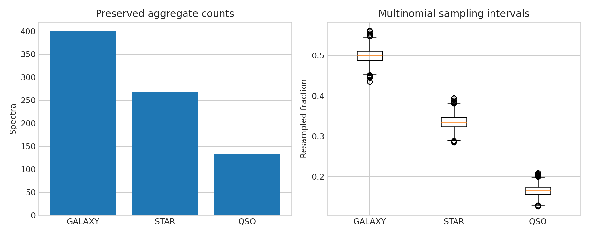

# SDSS class-composition audit for one sky patch

**Question:** What do the preserved aggregate counts support when the original 800 source rows were not saved?

This executed scientific audit reports provenance, uncertainty or robustness, reusable outputs, and explicit claim limits.

[Open the executed notebook](notebook.ipynb) · [Machine-readable result](result.json)
