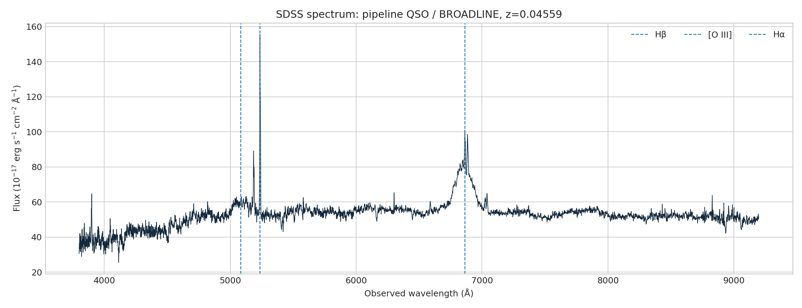

# SDSS source-identity audit: broad-line quasar

The exact product is not a star. SDSS labels it QSO/BROADLINE, and broad Balmer-line fits support that correction.

[Open the executed notebook](notebook.ipynb)
