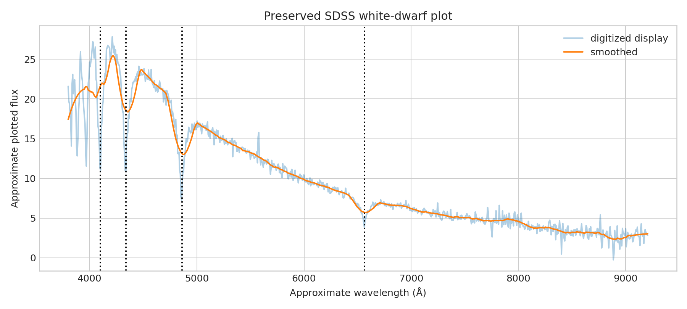

# SDSS white-dwarf Balmer-profile legacy audit

**Question:** Are the broad Balmer depressions visible robustly in the preserved spectrum plot?

This executed scientific audit reports provenance, uncertainty or robustness, reusable outputs, and explicit claim limits.

[Open the executed notebook](notebook.ipynb) · [Machine-readable result](result.json)
