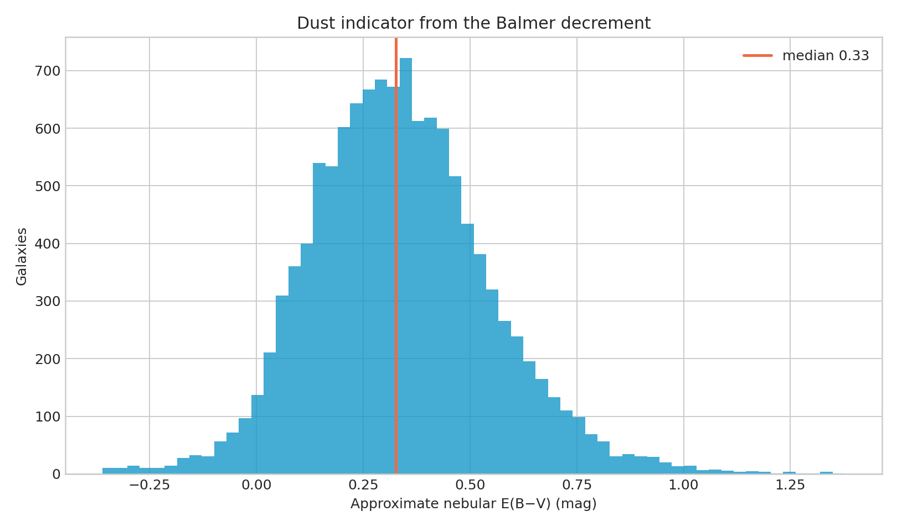

**Author:** Biswajit Jana  
**Date:** February 10, 2026

# Balmer decrement as a dust indicator in SDSS galaxies

**Question:** What colour excess is implied by the observed H-alpha to H-beta ratio?

This executed notebook uses the real public-archive subset preserved at
`../2026-07-31-sdss-bpt-galaxy-classification/sdss_bpt_query.csv`. It includes quality control, a numerical measurement, uncertainty,
a robustness check, interpretation, and explicit limits.

[Open the executed notebook](notebook.ipynb) · [Machine-readable result](result.json)

The notebook ends with archive documentation and comparison literature used to
frame the physical interpretation and its limits.
