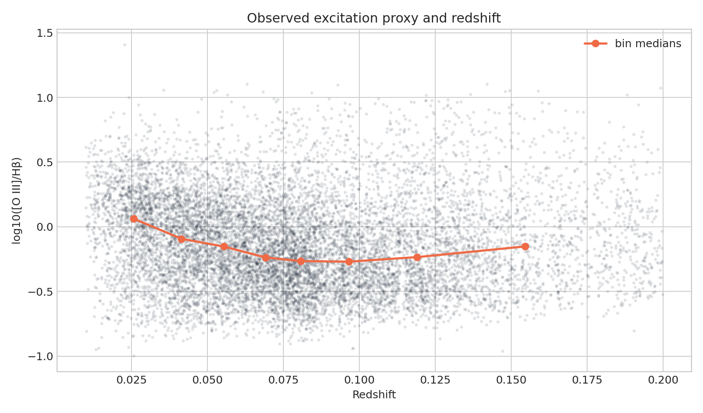

**Author:** Biswajit Jana  
**Date:** May 5, 2026

# Emission-line excitation against redshift in SDSS

**Question:** Does the observed [O III]/H-beta ratio change across this low-redshift selected sample?

This executed notebook uses the real public-archive subset preserved at
`../2026-07-31-sdss-bpt-galaxy-classification/sdss_bpt_query.csv`. It includes quality control, a numerical measurement, uncertainty,
a robustness check, interpretation, and explicit limits.

[Open the executed notebook](notebook.ipynb) · [Machine-readable result](result.json)

The notebook ends with archive documentation and comparison literature used to
frame the physical interpretation and its limits.
